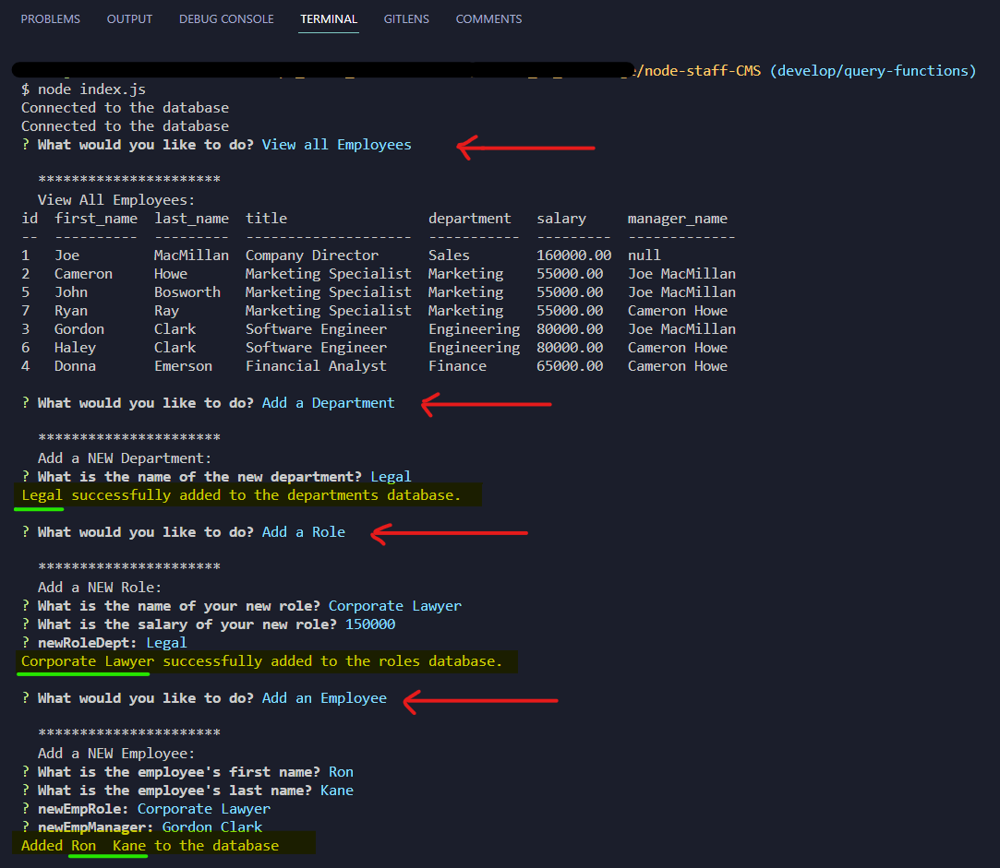
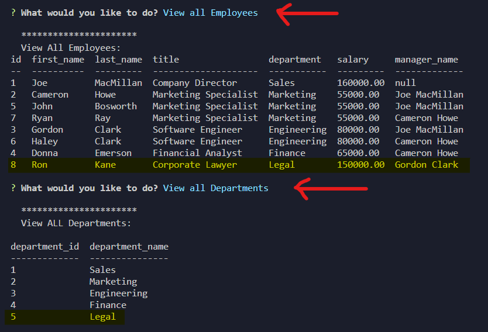

# Node Staff CMS
> Module 12 Challenge - SQL Challenge: Employee Tracker
  
  [](https://opensource.org/licenses/MIT)

  ## Description
  This application is a content management system that allows non-developers to easily view and interact with information stored in databases. It's a command-line application to assist managing a company's employee database, using Node.js, Inquirer, and MySQL.
<br>
<br>


  
  ## Table of Contents
  * [Demo](#demo)
  * [Installation](#installation)
  * [Features](#features)
  * [Contributing](#contributing)
  * [License](#license)
  * [Questions](#questions)

  ## Demo

  ### [Click here to view the VIDEO DEMO of this Application ➡️](https://watch.screencastify.com/v/1twyRIM8pQusWW68iref)

  
  
  
  
  ## Installation
  
1. Clone this GitHub repository to your local machine. <br> 
```sh
git clone https://github.com/CypherNyx/node-staff-CMS.git
```
2. Open a terminal or command prompt and navigate to the cloned repository's directory.
3. Run ```npm i``` to install the necessary dependencies.

### NPM and other Dependencies: 
 - Node.js
 - Inquirer
 - dotenv
 - mysql2
 - console.table


<br>
<br>

## Features
### Navigation

- Home page shows a menu to select:
  - View all departments
  - View all roles
  - View all employees
  - Add a department
  - Add a role
  - Add an employee
  - *Update employee role -- Coming Soon!*

### Departments

- View all departments - See a list of all departments with their id and name
- Add a department - Add a new department by entering the name
### Roles 

- View all roles - See a list of all job roles with their id, title, department, and salary
- Add a role - Add a new role by entering the title, salary, and department

### Employees

- View all employees - See a table of all employees with their id, first name, last name, job title, department, salary, and manager
- Add an employee - Add a new employee by entering their first name, last name, role, and manager
- *Coming Soon: Update employee role - Select an employee and update their job role*

### Database

- Persistent data storage using a database to store departments, roles, employees
- Ability to perform CRUD operations on the data
  
<br>
<br>

## Contributing
1. Fork it (<https://github.com/CypherNyx/node-staff-CMS/fork>)
2. Create your feature branch (`git checkout -b suggest/new-feature`)
3. Commit your changes (`git commit -m 'Add some new-feature'`)
4. Push to the branch (`git push origin suggest/new-feature`)
5. Create a new Pull Request

### Credits
I wrote the db Query to view all employees (index.js line: 131 - 143) and also created the variable to map over the department choices (index.js line: 184 and 186) with the assistance of Christian Guido.

  ## License
  [](https://opensource.org/licenses/MIT)
  
  https://opensource.org/licenses/MIT 
    

  ## Questions
  GitHub [CypherNyx](https://github.com/CypherNyx)<br>
  Email: dguido.dev@gmail.com

